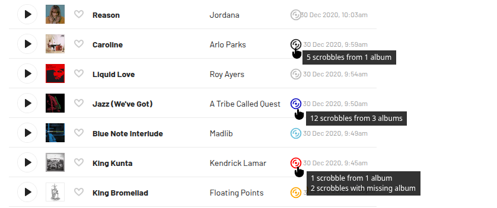
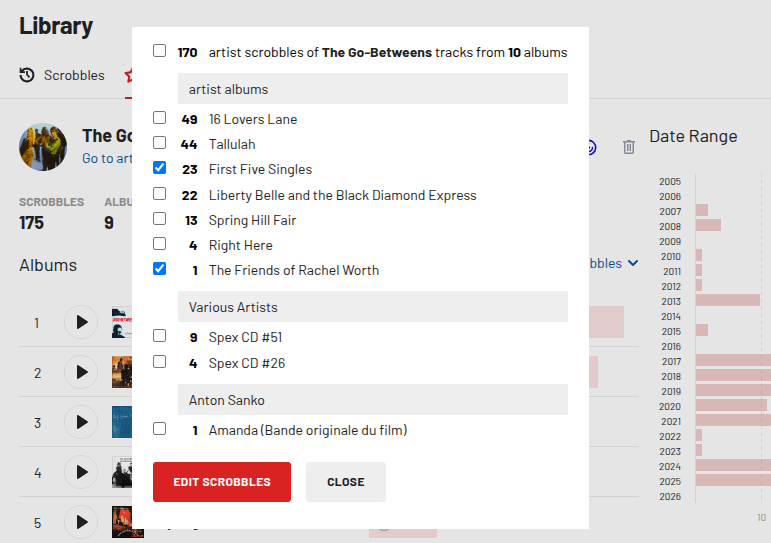
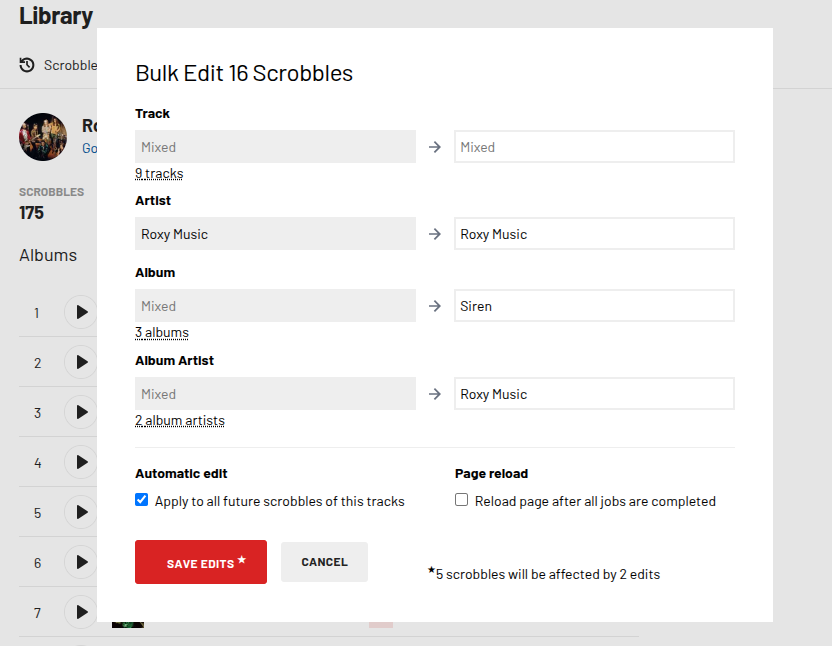
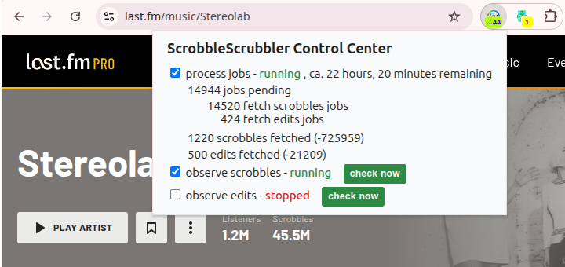
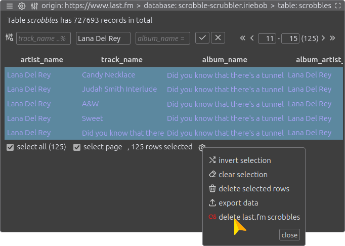

# ScrobbleScrubbler

Have you ever wished for a Last.fm that instantly displays your scrobble counts in a blink? And for a Last.fm that lets you edit your scrobbles without having to stare at a _&bdquo;Loading"_ message for minutes on end? Then ScrobbleScrubbler is a browser extension for Firefox and Chromium browsers that you should try to see if it meets your needs. Though, a Last.fm Pro subscription is required to do its jobs.

## 🧁 Main Features
* Adds icons to scrobbles, titles, albums, and artists displayed in lists, which provide information about the distribution of the specified number of scrobbles when hovered.
* Clicking an icon displays detailed information about the scrobbles of a track, album, or artist.
* Select one or more albums to edit all associated scrobbles together (also known as bulk edit).
* Select albums with the same name but by different artists for collective editing to correct wrong scrobbled Various Artists albums in one step.
* All processing happens in the background, so the Last.fm page is not blocked and no _&bdquo;You're requesting too many pages"_ incidents are caused.
* After installation, all scrobbles and saved automatic track edits are downloaded once in the background and saved in the browser.
* With [Kahuna](https://github.com/hummingme/kahuna)'s support, the scrobbles and automatic track edits data stored in the browser can be listed, filtered, selected. And the deletion of the data on Last.fm can be initiated.

Please read the [Usage](#%EF%B8%8F-usage) section for details.

## 💀 Warning
First, by maintaining its own database, ScrobbleScrubbler violates the good practice of the [_&bdquo;Single Source of Truth"_](https://en.wikipedia.org/wiki/Single_source_of_truth). Last.fm is always correct, and there are many reasons why the extensions database can fall behind and display incomplete or incorrect data. The main reason for this is when scrobbles are edited in a different browser.

Second, ScrobbleScrubbler is deeply interweaved with the Last.fm website. Any minor change to the site by the Last.fm team can (and most likely will) cause the extension to break completely.

Third, the extension is developed exclusively using my own Last.fm library as a training ground, and I discovered and solved **many** edge cases along the way. However, it is to be expected that some of your edge cases were overlooked.

On the good news, I've been using ScrobbbleScrubbler for more than half a year now and it has absolutely changed my life for the better ☺️.

## 🛸 Installation 
Please download and install the extension from the [Chrome Web Store](https://chromewebstore.google.com/detail/scrobblescrubbler/aagaghbcjcfmaplbckmjphchmbgbpblh) for Chrome and Chromium based browsers such as Edge, Brave, and Opera, and from the [Firefox Addons Page](https://addons.mozilla.org/en-US/firefox/addon/scrobblescrubbler) for Firefox.

<div align="center">
      <a href="https://chromewebstore.google.com/detail/scrobblescrubbler/aagaghbcjcfmaplbckmjphchmbgbpblh">
        </a>
      
      <a href="https://addons.mozilla.org/en-US/firefox/addon/scrobblescrubbler/">
        </a>
</div>

## 🕹️ Usage

### The Start
Before ScrobbleScrubbler can do anything, the extension needs to download the data from the Last.fm website. Since this is a fairly large process, it only happens after you initiate it: Look for the extensions icon, either directly in the browser bar or hidden behind a puzzle piece icon, and click it. A dialog box will open with some information about the upcoming download and with a large red button. After clicking the button, all you need is a little patience. For my > 700k scrobbles plus plenty of automatic edits, it takes almost a whole day to finish. 

<p align="center">
    
</p>

You can suspend the process at any time by closing the browser or turning off the device, it will resume once Last.fm is opened in your browser again.

It's perfectly fine to continue scrobbling, to use Last.fm, or to edit or delete scrobbles during the download process. My best advice is, to start the process in one browser tab first and then use the website in a separate tab opened afterward.

Once the download has started, disc icons will appear in the scrobble lists and your library lists. The numbers associated with the icons reflect the download progress and will therefore be incomplete until the download is finished.

You can monitor the download progress by hovering over the extension icon, or in more detail by clicking the icon.

### The Disk Icons
The discs appear in lists with scrobbles and in your library lists for tracks, albums, and artists. Hovering the icons with the mouse reveals some information about the associated scrobbles. Clicking a disk opens the [Info Popup](#the-info-popup).

<p align="center">
    
</p>

A grey/black icon indicates that all scrobbles of a track come from one album. A turquoise/blue icon indicates scrobbles of a track from multiple albums. If a track has an orange/red icon, there are scrobbles where the album data is missing.

If the discs are located next to an album or artist, the colors refer accordingly to the scobbles for the tracks of the album or artist.

Additionally, a green disc icon may appear next to an album, indicating that there are multiple albums with the same title. <kbd>Ctrl</kbd>-Click on the green disc opens a list where you can select which albums you want to edit together.

Rarely, a pink/violet disc with a question mark may appear if the extension database doesn't have matching information for a track, album, or artist. In that case, a repair attempt can be started with <kbd>Ctrl</kbd>-Click.

### The Info Popup
The dialog opens after clicking on a disc icon and displays a list of the albums on which the track, album or artist scrobbles are distributed. The list is divided into album artist sections and may have a line for scrobbles  without album data. Hovering the scrobble numbers with the mouse lists the track titles.

<p align="center">
    
</p>

The track, album, and artist names are linked to their library page. However, if you hold down <kbd>Ctrl</kbd> while clicking the link, the Last.fm track, album, and artist page will open.

The checkboxes allow you to specify which scrobbles you want to edit together in the edit popup.

### The Edit Popup
The edit popup is accessed via the _&bdquo;Edit Scrobbles"_ button in the Info Popup and it is used to combined edit the scrobbles of a track, album or artist together. The affected Scrobbles are limited to the albums previously selected in the Info Popup. 

<p align="center">
    
</p>

If the source data for an input field has several different values, the placeholder 'Mixed' is displayed in the field, and a text indicator below the field lists the source data when the mouse hovers it.

When saving, the original data is retained for fields containing the 'Mixed' placeholder. If a value is entered in such a field, this value is applied to all scrobbles. For your inspection, the number of scrobbles affected by the edit is displayed at the bottom of the form.

Checking the _&bdquo;Automatic edit"_ checkbox will save the automatic edit rule and will cause the changes to be applied to future scrobbles, just as it happens if you check the option in Last.fm's own edit form. You can view the automatic edit rules in your [profile](https://www.last.fm/settings/subscription/automatic-edits/tracks) or in [Kahuna](#deleting-scrobbles-and-automatic-edits).

If _&bdquo;Page reload"_ is checked on save, the current page will be reloaded after all modifications have performed in the background, but only if you don't navigate away before.

### The Control Center
Click the extension icon to get an overview of the pending background jobs waiting for execution. The  checkboxes allow you to start/stop the processing of jobs and the periodic checks for new scrobbles and edits that need to be retrieved. The screenshot shows the beginning of the initialization; usually the number of pending jobs will be low or zero.

<p align="center">
    
</p>

A maximum of about 10 to 12 background jobs are executed per minute, and if Last.fm is slow to respond, there may be even fewer. This requires patience, but prevents errors from being triggered by too many requests. Remember the checkbox as an emergency stop switch in case you accidentally selected the wrong scrobbles for deletion, or if you don't have a permanent internet connection and want to suspend the background requests.

When enabled, ScrobbleScrubbler checks for new scrobbles every 10 minutes and for new edits every 20 minutes to retrieve them and update its database. The buttons can be used to trigger an immediate update. The first page with 50 scrobbles or edits is read directly; for subsequent pages with new data background jobs are created.

### Deleting Scrobbles and Automatic Track Edits
To delete scrobbles and automatic track edits on Last.fm, ScrobbleScrubbler uses an external tool that allows access to the scrobble and edit data stored in the browser. [Kahuna](https://github.com/hummingme/kahuna), the IndexedDB Manager, is a browser extension for [Firefox](https://addons.mozilla.org/en-US/firefox/addon/kahuna-the-indexeddb-manager/) and [Chromium](https://chromewebstore.google.com/detail/kahuna/ilafpdbgcaodnkdklgemggjamhpdjile) browsers that allows the selection of scrobbles and edits and generates background jobs for ScrobbleScrubbler to delete them.

<p align="center">
    
</p>

There is [detailed documentation](https://hummingme.github.io/kahuna-docs/) for Kahuna, but here is an overview of the necessary steps to delete scrobbles after installing Kahuna:

* Click Kahuna's extension icon while the Last.fm page is displayed in your browser.
* Click on the database name `scrobble-scrubbler.{your-username}` to select the database.
* Click on `scrobbles` to select the table containing the scrobble data. Alternatively, the process works the same way with the `edits` table for deleting automatic track edits.
* Use the filters to display the scrobbles that are at risk of deletion.
* Click on individual rows to select the scrobbles, or use `select all` or `select page` below the table.
* Click the gear icon to display the selection tools and select `delete last.fm scrobbles`.
* Think about it again and confirm your intention.

In the example shown, 125 background jobs would be created, and after about 10 minutes my last Lana Del Rey scrobble would be irreversibly deleted.

### Refetching Scrobbles
It is very likely that the data in the extensions database will not always match the actual scrobbles and edits data 100%. There are many known and unknown reasons for this: errors in ScobbleScrubbler, errors in Last.fm, but most likely, scrobbles are being edited in other browsers. My best advice: Do not edit your scrobbles in other browsers, and make peace with the remaining differences.

However, if you ever have a reason to re-fetch the scrobble data for a specific period, this can be triggered with the special URL parameter `refetch`. Examples of how to trigger a re-fetch of scrobbles for a day, month, or year:
<p>`https://www.last.fm/home?refetch=2026-01-15`</p>
<p>`https://www.last.fm/home?refetch=2025-12`</p>
<p>`https://www.last.fm/home?refetch=2010`</p>

## 🎓 Frequently Asked Questions

### Why is a Last.fm Pro subscription required?<a id="faq1"></a>
Sorry, but it's not my fault. Only with Pro does the website have all the data that ScrobbleScrubbler needs to work. And editing scrobbles is also not possible without Pro.

### Why not feature X, Y or Z now that all the scrobble data is available in the browser?<a id="faq2"></a>
I can imagine that there are a lot of ideas about how the Last.fm page can be enhanced with the data. The first step towards realization is that you share your ideas, with a precise description in a [discussion](https://github.com/hummingme/scrobblescrubbler/discussions) or a [feature request](https://github.com/hummingme/scrobblescrubbler/issues). I don't promise anything, but popular ideas or those that excite me have a chance of being implemented. And otherwise there is always the option to fork the repository and do it for yourself.

### Why do I have to start the fetching of scrobbles every day again?<a id="faq3"></a>
You have probably configured all cookies and site data to be deleted when you close your browser. Because ScrobbleScrubbler's database belongs to the site data you'll have to make an exception.

The way to the setting on Chrome: Settings -> Privacy and security -> Site settings -> On-device site data -> Add "https://www.last.fm" in the section Allowed to save data on your device.

In Firefox: Settings -> Privacy & Security -> Cookie and Site Data -> Manage Exceptions... -> Add "https://www.last.fm" as allowed.

In general, you should exclude last.fm when deleting your cookie and website data if you want to preserve the ScrobbleScrubbler database. Or have made a backup beforehand.

### Wouldn't a different logic for the colors of the disk icons be much better?<a id="faq4"></a>
Mhm, possibly, who knows? My focus during development was to get support in cleaning up my scrobble data. And because I have a lot of scrobbles with missing albums and a lot of mis-scrobbled Various Artists albums, this has led to the partial dominance of the red and green discs. If there is consensus for a different color logic, this could be adjusted in the future. See also [this other question](#faq2).

### Were the Automatic Album Edits forgotten?<a id="faq5"></a>
No, they haven't been forgotten, but I don't use them and don't have any test data. If it turns out there is a lot of demand to manage automativc album edits, they may be added in the future.

### Scraping the data is slow and inefficient. Why isn't the Last.fm API used?<a id="faq6"></a>
The automatic edits data ist not supported by the API. And the [API call](https://www.last.fm/api/show/user.getRecentTracks) to retrieve scrobble data does not contain data about the album artist, which may be different from the track artist, and which is a prerequisite for editing scrobbles.

### ScrobbleScrubbler is so great, how can I show my support?<a id="faq7"></a>
Thank you so much! I am very happy about any feedback, whether in words or in the form of a github star for this repository or a positive review in the [Chrome Web Store](https://chromewebstore.google.com/detail/scrobblescrubbler/aagaghbcjcfmaplbckmjphchmbgbpblh) or the [Firefox Addons Page](https://addons.mozilla.org/en-US/firefox/addon/scrobblescrubbler/). Or use [https://buymeacoffee.com/hummingme](https://buymeacoffee.com/hummingme) to show your appreciation.

## 🛠️ Build and Install from Source
Installing [bun](https://bun.com/docs/installation) is a prerequisite. Then do:
``` shell
git clone https://github.com/hummingme/scrobblescrubbler.git
cd scrobblescrubbler
bun install 
bun release firefox & bun release chromium
```

## 👷‍♂️ Contributing
For bug reports and feature requests please [open an issue](https://github.com/hummingme/scrobblescrubbler/issues) in this repository. 

The development does not take place on github.com, but in a private repository. Pull requests are welcome too, but they will not be integrated here. Instead, after review and if appropriate, transferred to the private repository. For more complex code contributions, please contact me in advance.

## 🤘 Acknowledgements
* [Dexie](https://dexie.org/) wrapper library for the IndexedDB browser API
* [lit-html](https://lit.dev/docs/templates/overview/), the templating engine of the lit web components library
* [tabler](https://tabler.io/icons) svg icons
* and all the greats tools of the JavaScript ecosystem: typescript, bun, eslint, prettier, web-ext, and more

## 🧑‍⚖️ License
ScrobbleScrubbler is © Lutz Brückner <dev@kahuna.rocks>  and licensed under GNU General Public License Version 3, [GPL-3.0-or-later](https://www.gnu.org/licenses/gpl-3.0.txt).
